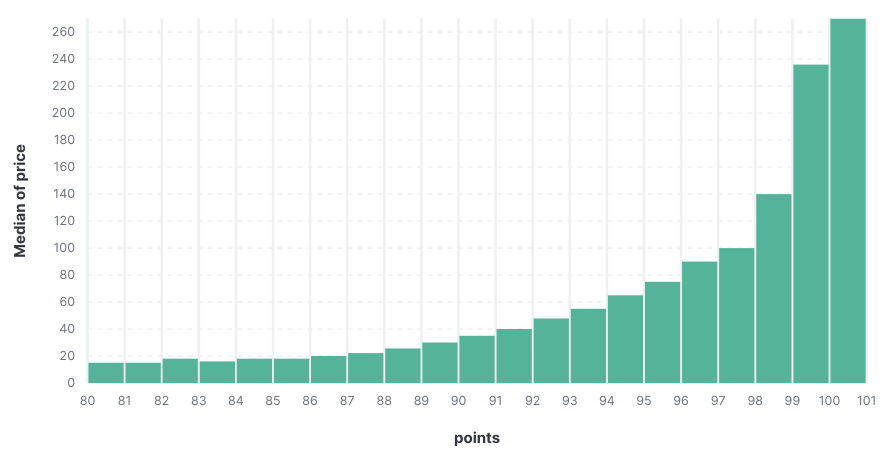
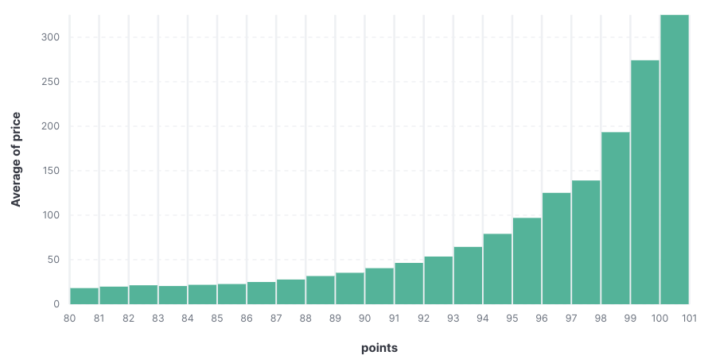
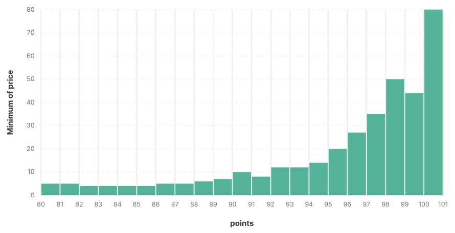
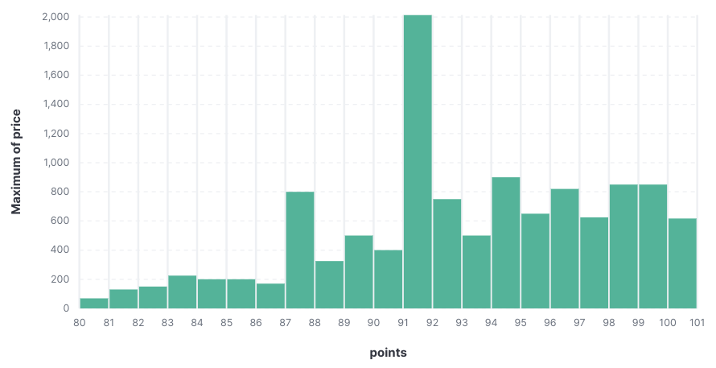

# lab1 / Мисюрина И. / 6233-010402D

### nifi  

Пайплайн:
- GetFile / читает файлы из директории по паттерну
- UpdateAttribute / релейблит файлнейм у считанного для того чтобы получился 1 итоговый файл
- SplitRecord / разделение на строки
- QueryRecord / фильтрация по строкам с ненулевыми атрибутами
  ```sql
  SELECT * FROM FLOWFILE WHERE designation IS NOT NULL AND region_1 IS NOT NULL;
  ```
- UpdateRecord / в `price` меняет `null` на `0.0` (`/price: ${field.value:replaceNull(0.0)}`)
- MergeRecord (х2) / объединение строк, выполнялось в 2 этапа тк попытка объединить сразу кучу
элементов привела к тому, что очереди переполнялись и почти что не разгребались. Первым этапом
собирает блоки по 1000-5000 строк, вторым - блоки от 50000 строк
- PutFile / сохранение итогового файла
- PutElasticsearchHttpRecord / отсылка записей в эластик

### airflow

DAG's tasks:
- read / читает файлы, считанное сохраняет в буферный файл
- drop / делает dropna по сабсету `designation`, `region_1`
- fill / fillna, замена нулов в `price` на `0.0`
- save_csv / сохранение файла с предыдущего шага, по сути очень замысловатое 
`cp src dst` сделанное для формального соответствия пайплайну лабы
- save_els / топим эластик запросами (1 строка - 1 запрос)

### elasticsearch & kibana  

График points & median price  

График points & average price  

График points & min price  

График points & max price  


### additional  

Обнаружив репу с преконфигами среды, решила запустить все нужное 
и ненужное сразу из интереса упадет/не упадет, сожрет память/не сожрет.
~~Промышленные сервера держат тыщи контейнеров, чем мой ноут хуже?~~
Обнаружен баг с mysql/mysql-server:5.7.28 - контейнер утекает,
сколько ему не выдавай лимитов. Патч-версия пониже с багом, 
последняя патч-версия без фиксов, смена мажора (на 8.0.32) проблему решила.